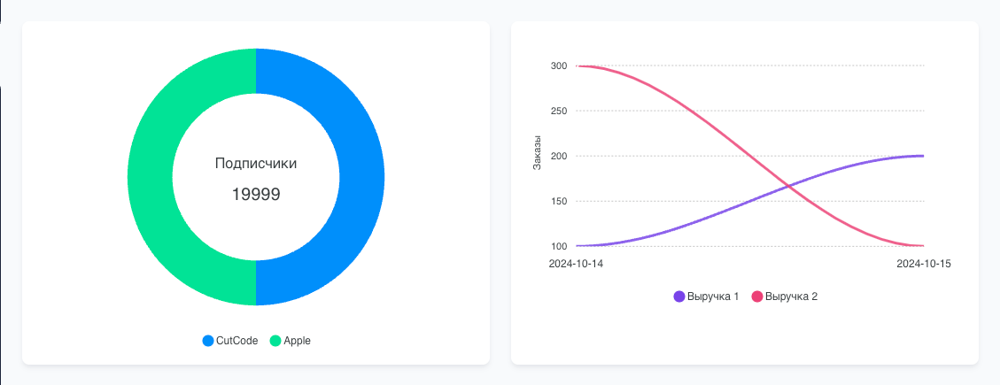

# ApexCharts for [MoonShine Laravel admin panel](https://moonshine-laravel.com)

<picture>
    <source media="(prefers-color-scheme: dark)" srcset="./art/apexcharts_dark.png">
    <source media="(prefers-color-scheme: light)" srcset="./art/apexcharts.png">
    
</picture>

> [!NOTE]
> The package is based on the [ApexCharts](https://apexcharts.com/) library.

---

## Compatibility

| MoonShine | Moonshine ApexCharts | Currently supported |
|:---------:|:--------------------:|:-------------------:|
| \>= v3.0  |      \>= v1.0.0      |         yes         |

## Installation
```shell
composer require moonshine/apexcharts
```

## Metric Donut Chart

The ***DonutChartMetric*** metric is designed for creating Donut charts.

### Make

You can create ***DonutChartMetric*** using the static `make()` method.

```php
make(Closure|string $label)
```

Method `values()` allows you to specify the relevance for a metric.

```php
values(array|Closure $values)
```

```php
use MoonShine\Apexcharts\Components\DonutChartMetric;

DonutChartMetric::make('Subscribers') 
    ->values(['CutCode' => 10000, 'Apple' => 9999]) 
```

<picture>
    <source media="(prefers-color-scheme: dark)" srcset="./art/donut_chart_metric_dark.png">
    <source media="(prefers-color-scheme: light)" srcset="./art/donut_chart_metric.png">
    
</picture>

### Colors

The `colors()` method allows you to specify colors for the metric.

```php
colors(array|Closure $values)
```

```php
DonutChartMetric::make('Subscribers')
    ->values(['CutCode' => 10000, 'Apple' => 9999])
    ->colors(['#ffcc00', '#00bb00'])
```

### Decimal places

The `decimals()` method allows you to specify the maximum number of decimal places for the total value.

> [!NOTE]
> By default, up to three decimal places are displayed.

```php
DonutChartMetric::make('Subscribers')
    ->values(['CutCode' => 10000.12, 'Apple' => 9999.32])
    ->decimals(0) 
```

### Block width

Method `columnSpan()` allows you to set the block width in the *Grid* grid.

```php
columnSpan(
    int $columnSpan,
    int $adaptiveColumnSpan = 12
)
```

- `$columnSpan` - relevant for desktop,
- `$adaptiveColumnSpan` - relevant for mobile version.

```php
use MoonShine\Apexcharts\Components\DonutChartMetric;
use MoonShine\UI\Components\Layout\Grid;

Grid::make([ 
    DonutChartMetric::make('Subscribers')
        ->values(['CutCode' => 10000, 'Apple' => 9999])
        ->columnSpan(6), 
    DonutChartMetric::make('Tasks')
        ->values(['New' => 234, 'Done' => 421])
        ->columnSpan(6) 
]) 
```

<picture>
    <source media="(prefers-color-scheme: dark)" srcset="./art/donut_chart_metric_column_span_dark.png">
    <source media="(prefers-color-scheme: light)" srcset="./art/donut_chart_metric_column_span.png">
    
</picture>

> [!NOTE]
> See the [Decoration Layout](https://moonshine-laravel.com/docs/resource/components/components-decoration_layout) section for more details.

## Metric Line Chart

The ***LineChartMetric*** metric is designed to display line charts.

### Make

You can create a ***LineChartMetric** using the static `make()` method.

```php
make(Closure|string $label)
```

The `line()` method allows you to add a value line to the metric. You can add multiple lines to *ValueMetric*.

```php
line(
    array|Closure $line,
    string|array|Closure $color = '#7843E9'
)
```

- `$line` - values for charting,
- `$color` - line color.

```php
use MoonShine\Apexcharts\Components\LineChartMetric;

LineChartMetric::make('Orders') 
    ->line([
        'Profit' => Order::query()
            ->selectRaw('SUM(price) as sum, DATE_FORMAT(created_at, "%d.%m.%Y") as date')
            ->groupBy('date')
            ->pluck('sum','date')
            ->toArray()
    ])
    ->line([
        'Avg' => Order::query()
            ->selectRaw('AVG(price) as avg, DATE_FORMAT(created_at, "%d.%m.%Y") as date')
            ->groupBy('date')
            ->pluck('avg','date')
            ->toArray()
    ], '#EC4176') 
```

<picture>
    <source media="(prefers-color-scheme: dark)" srcset="./art/line_chart_metric_dark.png">
    <source media="(prefers-color-scheme: light)" srcset="./art/line_chart_metric.png">
    
</picture>

You can define multiple lines through one `line()` method.

```php
LineChartMetric::make('Orders') 
    ->line([
        'Profit' => Order::query()
            ->selectRaw('SUM(price) as sum, DATE_FORMAT(created_at, "%d.%m.%Y") as date')
            ->groupBy('date')
            ->pluck('sum','date')
            ->toArray(),
        'Avg' => Order::query()
            ->selectRaw('AVG(price) as avg, DATE_FORMAT(created_at, "%d.%m.%Y") as date')
            ->groupBy('date')
            ->pluck('avg','date')
            ->toArray()
    ],[
        'red', 'blue'
    ])
```

### Sorting keys

By default, the LineChart chart has its keys sorted in ascending order. This feature can be disabled using the `withoutSortKeys()` method.

```php
LineChartMetric::make('Orders')
    ->line([
        'Profit' => Order::query()
            ->selectRaw('SUM(price) as sum, DATE_FORMAT(created_at, "%d.%m.%Y") as date')
            ->groupBy('date')
            ->pluck('sum','date')
            ->toArray()
    ])
    ->withoutSortKeys(), 
```

### Block width

Method `columnSpan()` allows you to set the block width in the *Grid* grid.

```php
columnSpan(
    int $columnSpan,
    int $adaptiveColumnSpan = 12
), 
```

- `$columnSpan` - relevant for desktop,
- `$adaptiveColumnSpan` - relevant for mobile version.

```php
use MoonShine\Apexcharts\Components\LineChartMetric;
use MoonShine\UI\Components\Layout\Grid;

Grid::make([ 
    LineChartMetric::make('Articles')
        ->line([
            'Count' => [
                now()->subDays()->format('Y-m-d') =>
                    Article::whereDate(
                        'created_at',
                        now()->subDays()->format('Y-m-d')
                    )->count(),
                now()->format('Y-m-d') =>
                    Article::whereDate(
                        'created_at',
                        now()->subDays()->format('Y-m-d')
                    )->count()
            ]
        ])
        ->columnSpan(6), 
    LineChartMetric::make('Comments')
        ->line([
            'Count' => [
                now()->subDays()->format('Y-m-d') =>
                    Comment::whereDate(
                        'created_at',
                        now()->subDays()->format('Y-m-d')
                    )->count(),
                now()->format('Y-m-d') =>
                    Comment::whereDate(
                        'created_at',
                        now()->subDays()->format('Y-m-d')
                    )->count()
            ]
        ])
        ->columnSpan(6) 
])
```

<picture>
    <source media="(prefers-color-scheme: dark)" srcset="./art/line_chart_metric_column_span_dark.png">
    <source media="(prefers-color-scheme: light)" srcset="./art/line_chart_metric_column_span.png">
    
</picture>

> [!NOTE]
> See the [Decoration Layout](https://moonshine-laravel.com/docs/resource/components/components-decoration_layout) section for more details.

