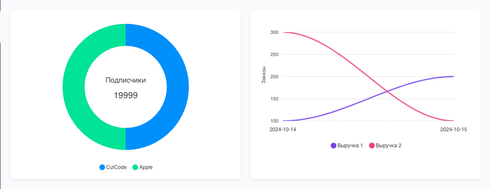
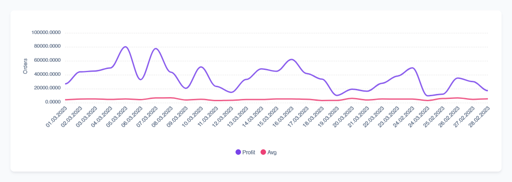
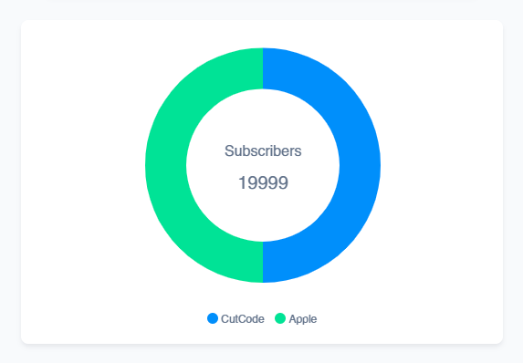
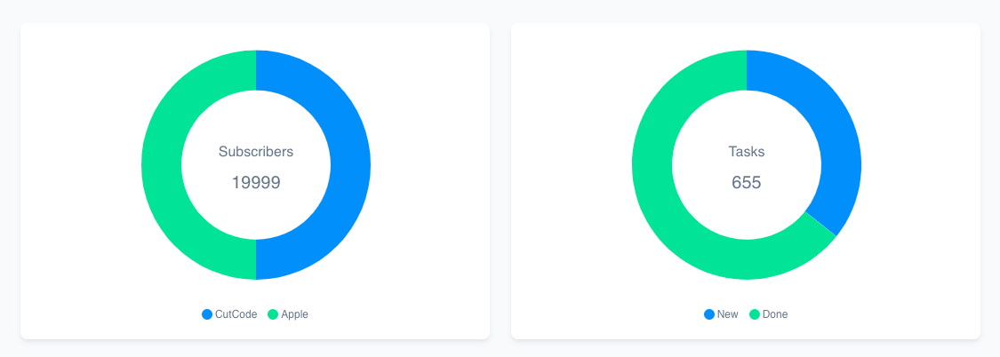
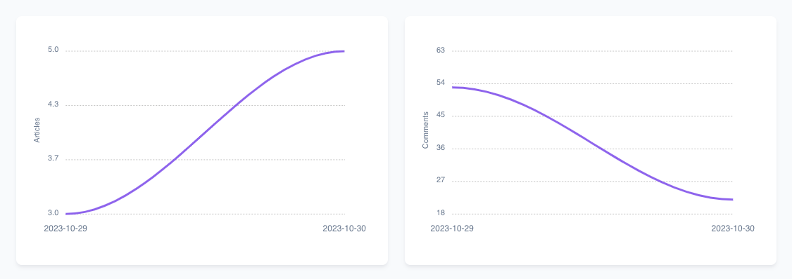

# ApexCharts for [MoonShine](https://moonshine-laravel.com) Laravel admin panel

[](https://packagist.org/packages/moonshine/apexcharts)
[](https://packagist.org/packages/moonshine/apexcharts)

<picture>
    <source media="(prefers-color-scheme: dark)" srcset="./art/apexcharts_dark.png">
    <source media="(prefers-color-scheme: light)" srcset="./art/apexcharts.png">
    
</picture>

> [!NOTE]
> This package adds [ApexCharts.js](https://apexcharts.com/) components to the [MoonShine](https://moonshine-laravel.com/) Laravel admin panel.

## Compatibility

| MoonShine | Moonshine ApexCharts | Currently supported |
|:---------:|:--------------------:|:-------------------:|
| \>= v3.0  |      \>= v1.0.0      |         no          |
| \>= v3.0  |      \>= v3.0.0      |         yes         |

## Installation

Install the package via Composer:

```bash
composer require moonshine/apexcharts
```

Publish the assets:

```bash
php artisan vendor:publish --tag=moonshine-apexcharts-assets --force
```

Optional: Publish the configuration file to customize default settings:

```bash
php artisan vendor:publish --tag=moonshine-apexcharts-config
```

## Available Chart Types

- **Line Chart** - Linear, area, and column charts for time-series data with full typing support
- **Donut Chart** - Circular charts for categorical data
- **Sparkline Chart** - Minimalist charts for KPI cards with value and change indicators
- **Raw Chart** - Direct access to ApexCharts configuration for maximum flexibility

## Quick Start

### Line Chart

```php
use MoonShine\Apexcharts\Components\LineChartMetric;
use MoonShine\Apexcharts\Support\SeriesItem;

LineChartMetric::make('Заказы')
    ->series([
        SeriesItem::make('Выручка 1', [
            now()->format('Y-m-d') => 100,
            now()->addDay()->format('Y-m-d') => 200,
            now()->addDays(2)->format('Y-m-d') => 500,
            now()->addDays(3)->format('Y-m-d') => 700,
        ])->color('#EC4176'),
        SeriesItem::make('Выручка 2', [
            now()->format('Y-m-d') => 300,
            now()->addDay()->format('Y-m-d') => 400,
            now()->addDays(2)->format('Y-m-d') => 300,
            now()->addDays(3)->format('Y-m-d') => 800,
        ])->color('#85737E'),
        SeriesItem::make('Выручка 3', [
            now()->format('Y-m-d') => 400,
            now()->addDay()->format('Y-m-d') => 500,
            now()->addDays(2)->format('Y-m-d') => 400,
            now()->addDays(3)->format('Y-m-d') => 600,
        ])->color('#1e96fc'),
    ]),

LineChartMetric::make('Заказы')
    ->series([
        SeriesItem::make('Выручка 1', [
            now()->format('Y-m-d') => 100,
            now()->addDay()->format('Y-m-d') => 200,
            now()->addDays(2)->format('Y-m-d') => 500,
            now()->addDays(3)->format('Y-m-d') => 700,
        ])->line(),
        SeriesItem::make('Выручка 2', [
            now()->format('Y-m-d') => 300,
            now()->addDay()->format('Y-m-d') => 400,
            now()->addDays(2)->format('Y-m-d') => 300,
            now()->addDays(3)->format('Y-m-d') => 800,
        ])->area(),
        SeriesItem::make('Выручка 3', [
            now()->format('Y-m-d') => 400,
            now()->addDay()->format('Y-m-d') => 500,
            now()->addDays(2)->format('Y-m-d') => 400,
            now()->addDays(3)->format('Y-m-d') => 600,
        ])->column(),
    ])
```

<picture>
    <source media="(prefers-color-scheme: dark)" srcset="./art/line_chart_metric_dark.png">
    <source media="(prefers-color-scheme: light)" srcset="./art/line_chart_metric.png">
    
</picture>

### Donut Chart

```php
use MoonShine\Apexcharts\Components\DonutChartMetric;

DonutChartMetric::make('Traffic Sources')
    ->values([
        'Direct' => 3250,
        'Organic' => 2100,
        'Social' => 1850,
        'Referral' => 1200,
    ]);
```

<picture>
    <source media="(prefers-color-scheme: dark)" srcset="./art/donut_chart_metric_dark.png">
    <source media="(prefers-color-scheme: light)" srcset="./art/donut_chart_metric.png">
    
</picture>

### Sparkline Chart

Minimalist area charts perfect for KPI cards and dashboard widgets:

```php
use MoonShine\Apexcharts\Components\SparklineChartMetric;

// Basic sparkline with value and change indicator
SparklineChartMetric::make('Revenue')
    ->values([30, 40, 35, 50, 49, 60, 70, 91, 125])
    ->value('192.10k', prefix: '$')
    ->change(32, suffix: 'k')
    ->colors(['#10b981'])
```

**With decrease indicator (negative change):**

```php
SparklineChartMetric::make('Expenses')
    ->values([100, 95, 90, 85, 80, 75])
    ->value('45.5k', prefix: '$')
    ->change(-12, suffix: 'k')
    ->colors(['#ef4444'])
```

**Custom change text (localization):**

```php
SparklineChartMetric::make('Users')
    ->values([10, 20, 30, 40, 50])
    ->value('1,234')
    ->change(156)
    ->changeText('growth', 'decline')
```

**Straight line instead of smooth curve:**

```php
SparklineChartMetric::make('Orders')
    ->values([5, 8, 12, 15, 20])
    ->value(847)
    ->change(23, suffix: '%')
    ->straight()
```

**Without gradient fill:**

```php
SparklineChartMetric::make('Visits')
    ->values([50, 60, 55, 70, 65])
    ->value('12.5k')
    ->withoutGradient()
    ->colors(['#3b82f6'])
```

**Minimal sparkline (no value display):**

```php
SparklineChartMetric::make('Trend')
    ->values([1, 3, 2, 4, 3, 5, 4, 6])
    ->colors(['#8b5cf6'])
    ->height(40)
```

**With icon and custom icon color:**

```php
use MoonShine\Support\Enums\Color;

SparklineChartMetric::make('Revenue')
    ->icon('heroicons.currency-dollar')
    ->iconColor(Color::SUCCESS)
    ->values([30, 40, 35, 50, 49, 60, 70])
    ->value('192.10k', prefix: '$')
    ->change(32, suffix: 'k')
    ->colors(['#10b981'])
```

Available icon colors: `Color::PRIMARY`, `Color::SECONDARY`, `Color::SUCCESS`, `Color::WARNING`, `Color::ERROR`, `Color::INFO`

### Raw Chart

For custom chart types or advanced configurations:

```php
use MoonShine\Apexcharts\Components\RawChartMetric;

RawChartMetric::make('Interactive Radar Chart')
    ->config([
        'chart' => [
            'type' => 'radar',
            'height' => 350,
        ],
        'series' => [
            [
                'name' => 'Current Year',
                'data' => [20, 90, 45, 75, 60],
            ],
        ],
        'xaxis' => [
            'categories' => ['Q1', 'Q2', 'Q3', 'Q4', 'Q5'],
        ],
    ])
    ->jsChartEvents(<<<'JS'
        {
            click: (chartContext, options) => {
                console.log('Chart clicked:', options);
            }
        }
    JS);
```

## Theme Configuration

The `theme()` method allows you to configure chart appearance with color palettes and monochrome options:

```php
->theme(
    int|string|null $palette = null,      // Color palette (1-10) or palette name
    bool $monochromeEnabled = false,      // Enable monochrome colors
    bool $monochromeLight = false,        // Monochrome shade direction
    ?string $monochromeColor = null,      // Custom monochrome base color
    float $monochromeShadeIntensity = 0.65 // Monochrome shade intensity (0-1)
)
```

### Theme Examples

**Simple palette:**
```php
->theme(6)  // Use predefined color palette
```

**Monochrome with custom color:**
```php
->theme(
    monochromeEnabled: true,
    monochromeColor: '#FF6384',
    monochromeShadeIntensity: 0.5
)
```

## API Reference

### Common Methods

Available for all chart types:

- `->withoutWrapper()` - Remove box wrapper for custom layouts
- `->columnSpan(int $span)` - Number of grid columns (1-12)
- `->colors(array $colors)` - Override palette with custom colors
- `->theme(...)` - Configure theme with palette and options
- `->height(int $height)` - Chart height in pixels
- `->icon(string $icon)` - Set icon (e.g., `'heroicons.chart-bar'`)
- `->iconColor(Color $color)` - Set icon color using `MoonShine\Support\Enums\Color`
- `->jsChartEvents(string $js)` - JavaScript event handlers

### LineChartMetric

- `->series(array|SeriesItem $series)` - Add series
- `->withoutSortKeys()` - Preserve original key order

```php
SeriesItem::make(string $name, array $data)
    ->line()                // Line chart type
    ->area()                // Area chart type
    ->column()              // Column chart type
    ->color('#FF5722')      // Custom color
    ->name('New Name')      // Change display name
    ->data([...])           // Update data
```

### DonutChartMetric

- `->values(array $values)` - Chart data (key => value)
- `->decimals(int $decimals)` - Decimal places (0-100)

### SparklineChartMetric

**Data methods:**
- `->values(array $values)` - Array of numeric values for the chart

**Value display:**
- `->value(string|int|float $value, ?string $prefix, ?string $suffix)` - Main value to display
- `->change(string|int|float $value, ?string $prefix, ?string $suffix)` - Change indicator (positive = green, negative = red)
- `->changeText(string $increase, string $decrease)` - Custom text for increase/decrease labels
- `->withoutChangeText()` - Hide increase/decrease text, show only value and icon

**Chart appearance:**
- `->curve(string $curve)` - Curve type: `'smooth'`, `'straight'`, `'stepline'`, `'monotoneCubic'`
- `->straight()` - Shortcut for `->curve('straight')`
- `->gradient(bool $enabled, float $opacityFrom, float $opacityTo)` - Configure gradient fill
- `->withoutGradient()` - Disable gradient fill (line only)
- `->strokeWidth(int $width)` - Line thickness (default: 2)
- `->withoutTooltip()` - Disable hover tooltip

### RawChartMetric

- `->config(array $config)` - Full ApexCharts configuration

## Events

Add interactivity with JavaScript events:

```php
RawChartMetric::make('Interactive Chart')
    ->jsChartEvents(<<<'JS'
        {
            dataPointSelection: (event, chartContext, config) => {
                console.log('Selected:', config.w.config.labels[config.dataPointIndex]);
            },
            click: (chartContext, options) => {
                // Handle chart click
            }
        }
    JS);
```

## Grid Layout

Charts can be arranged in a responsive grid using MoonShine's `Grid` component and the `columnSpan()` method.

### Basic Grid Usage

```php
use MoonShine\UI\Components\Layout\Grid;
use MoonShine\Apexcharts\Components\DonutChartMetric;
use MoonShine\Apexcharts\Components\LineChartMetric;
use MoonShine\Apexcharts\Components\SparklineChartMetric;
use MoonShine\Apexcharts\Components\RawChartMetric;

Grid::make([
    DonutChartMetric::make('Traffic Sources')
        ->values([
            'Direct' => 3250,
            'Organic' => 2100,
            'Social' => 1850,
            'Referral' => 1200,
        ])
        ->theme(2)
        ->columnSpan(4),

    DonutChartMetric::make('Sales by Category')
        ->values([
            'Electronics' => 45320,
            'Clothing' => 32150,
            'Food' => 28900,
            'Books' => 12300,
        ])
        ->theme(7)
        ->columnSpan(4),

    DonutChartMetric::make('User Activity')
        ->values([
            'Active' => 1250,
            'Inactive' => 320,
            'New' => 180,
            'Old' => 250,
        ])
        ->theme(1)
        ->columnSpan(4),
])
```

<picture>
    <source media="(prefers-color-scheme: dark)" srcset="./art/donut_chart_metric_column_span_dark.png">
    <source media="(prefers-color-scheme: light)" srcset="./art/donut_chart_metric_column_span.png">
    
</picture>

<picture>
    <source media="(prefers-color-scheme: dark)" srcset="./art/line_chart_metric_column_span_dark.png">
    <source media="(prefers-color-scheme: light)" srcset="./art/line_chart_metric_column_span.png">
    
</picture>

### Sparkline KPI Dashboard

```php
Grid::make([
    SparklineChartMetric::make('Revenue')
        ->values([30, 40, 35, 50, 49, 60, 70, 91, 125])
        ->value('192.10k', prefix: '$')
        ->change(32, suffix: 'k')
        ->colors(['#10b981'])
        ->columnSpan(3),

    SparklineChartMetric::make('Orders')
        ->values([120, 132, 101, 134, 90, 230, 210])
        ->value('1,847')
        ->change(12.5, suffix: '%')
        ->colors(['#3b82f6'])
        ->columnSpan(3),

    SparklineChartMetric::make('Customers')
        ->values([220, 182, 191, 234, 290, 330, 310])
        ->value('9,432')
        ->change(8.2, suffix: '%')
        ->colors(['#8b5cf6'])
        ->columnSpan(3),

    SparklineChartMetric::make('Refunds')
        ->values([150, 232, 201, 154, 190, 130, 110])
        ->value('2.4k', prefix: '$')
        ->change(-18, suffix: '%')
        ->colors(['#ef4444'])
        ->columnSpan(3),
])
```

## License

This package is open-sourced software licensed under the [MIT license](LICENSE.md).
